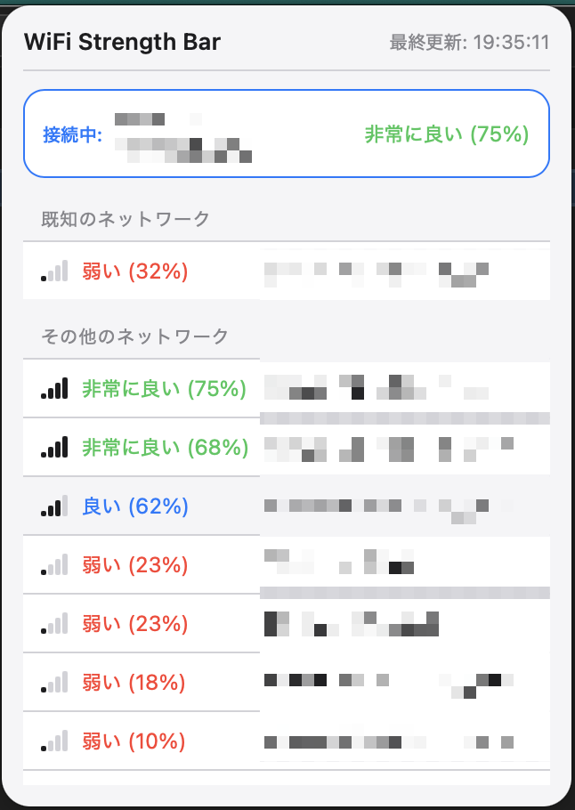

# WiFi Strength Bar

macOSメニューバーに常駐するWiFi電波強度モニター

## 機能

- メニューバーからワンクリックでWiFi一覧を表示
- 周囲のWiFiを3秒ごとに自動スキャン
- 電波強度をパーセンテージで表示
- 現在接続中のWiFiを強調表示
- より強いWiFiが見つかった場合に通知
- 既知のネットワークを識別

## スクリーンショット



## 必要環境

- macOS 10.13 以上
- Node.js
- Rust

## インストール

### 依存関係のインストール

```bash
npm install
```

### 開発モードで起動

```bash
npm run tauri dev
```

### ビルド

```bash
npm run tauri build
```

## 使い方

1. アプリを起動するとメニューバーにアイコンが表示されます
2. アイコンをクリックするとWiFi一覧が表示されます
3. 右クリックでメニュー（表示/終了）が表示されます

## 開発

### テスト実行

```bash
npm test
```

### テスト（ウォッチモード）

```bash
npm run test:watch
```

## 技術スタック

- Tauri 2.0
- React 18 + TypeScript
- Vite
- macOS CoreWLAN / CoreLocation API
